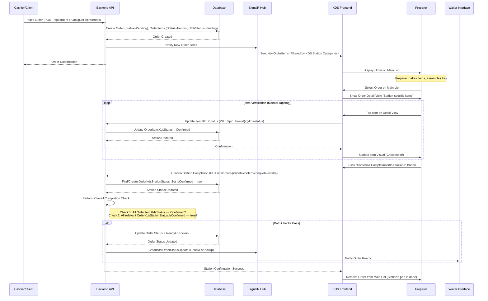

# SagraFacile - Kitchen Display System (KDS) Architecture

This document outlines the architecture and workflow for the Kitchen Display System (KDS) feature in SagraFacile.

## 1. Core Concept & Purpose

*   **Purpose:** Provide digital displays for food/drink preparation stations (e.g., Cucina, Bar, Pizzeria) to manage and verify order items.
*   **Primary Goal:** Act as a final checklist for preparers before handing off a completed tray ("vassoio") to the waiter, ensuring all items assigned to that station for a given order are present.
*   **Filtering:** Each KDS instance displays only the order items relevant to the menu categories assigned to that specific station.

## 2. Workflow

1.  **Order Placement:** An order is placed (e.g., via Cashier or Pre-Order).
    *   `Order.Status` is set (e.g., `Pending`).
    *   Each `OrderItem` gets `Status = Pending` and `KdsStatus = Pending`.
2.  **KDS Notification:** The backend (via SignalR) pushes the relevant `OrderItem` details (those matching the station's assigned categories) to the corresponding KDS client(s).
3.  **KDS Main View:** The KDS interface displays a list/grid of active orders. An order appears here if it contains at least one `OrderItem` assigned to this station's categories AND that item has `KdsStatus = Pending`.
4.  **Preparation:** The preparer uses the physical printed "comanda" (or potentially the KDS view) to prepare the items for their station and assembles the tray.
5.  **Verification Step (Pre-Handover):**
    *   The preparer locates and selects the order on the KDS main view.
    *   An "Order Detail" view/modal appears, showing **only** the items for that order belonging to **this specific KDS station**. Quantity and Notes are clearly visible.
    *   The preparer compares the physical tray items against this digital checklist.
    *   The preparer **taps each item line** on the KDS screen to confirm its presence on the tray.
    *   Tapping toggles the `OrderItem.KdsStatus` between `Pending` and `Confirmed` (visual feedback like strikethrough/checkmark is shown). This updates the individual item status via the API (`PUT /api/orders/.../items/{id}/kds-status`).
6.  **Station Confirmation:** Once all items for this station are prepared and marked (`OrderItem.KdsStatus = Confirmed`), the preparer clicks a "Conferma Completamento Stazione" (Station Confirmation) button.
    *   This action calls a modified API endpoint (`PUT /api/orders/{orderId}/kds-confirm-complete/{kdsStationId}`).
    *   The backend marks this specific KDS station as having completed its part for this order (e.g., sets `IsConfirmed = true` in a new `OrderKdsStationStatus` table).
7.  **KDS List Update:** When the station confirmation is successfully registered by the backend:
    *   The order **disappears** from this specific KDS station's active list.
8.  **Overall Order Readiness:**
    *   After a station confirms via the API (`PUT .../kds-confirm-complete/{kdsStationId}`), the backend performs a check:
        *   **Condition 1:** Are **all** `OrderItems` for the entire `Order` (across all categories/stations) marked with `KdsStatus = Confirmed`?
        *   **Condition 2:** Have **all** KDS stations involved in preparing this order marked their part as complete (i.e., `IsConfirmed = true` in `OrderKdsStationStatus` for all relevant stations)?
    *   If **both** conditions are met, the backend updates the main `Order.Status` to `ReadyForPickup`.
    *   This `Order.Status` change is broadcast via SignalR to relevant clients (e.g., Waiter Interface, Admin Overview).

## 2.1. Workflow Diagram

## 3. Technical Components

### 3.1. Database Schema Changes

*   **New Models:**
    *   `OrderKdsStationStatus`: Tracks when a specific KDS station has confirmed completion of its assigned items for a given order.
        *   `OrderId` (string, PK, FK to `Order`)
        *   `KdsStationId` (int, PK, FK to `KdsStation`)
        *   `IsConfirmed` (boolean, default `false`)
        *   Navigation properties: `Order`, `KdsStation`
    *   `KdsStation`: Represents a physical KDS display/station.
        *   `Id` (int, PK)
        *   `Name` (string, required)
        *   `AreaId` (int, FK to `Area`, required)
        *   `OrganizationId` (int, FK to `Organization`, required)
        *   Navigation properties: `Area`, `Organization`, `KdsCategoryAssignments`
    *   `KdsCategoryAssignment`: Links Menu Categories to KDS Stations.
        *   `KdsStationId` (int, PK, FK to `KdsStation`)
        *   `MenuCategoryId` (int, PK, FK to `MenuCategory`)
        *   Navigation properties: `KdsStation`, `MenuCategory`
*   **Model Updates:**
    *   `OrderItem`:
        *   Add `KdsStatus` (enum: `Pending = 0`, `Confirmed = 1`, default `Pending`).
        *   *(Existing `Status` enum likely remains for overall item prep progress if needed later, but KDS focuses on `KdsStatus`)*.
    *   `Order`:
        *   Add `ReadyForPickup` to the `OrderStatus` enum.

### 3.2. Backend (.NET API)

*   **Services:**
    *   `KdsStationService`: Handles CRUD for `KdsStation` and `KdsCategoryAssignment` (within Area/Org context).
    *   `OrderService`:
        *   Modify methods fetching orders for KDS (`GetActiveOrdersForKdsStationAsync`) to filter primarily by `Order.Status = Preparing` and potentially check `OrderKdsStationStatus` to exclude orders already confirmed by *this* station. Item filtering happens during projection.
        *   Implement the new `ConfirmKdsOrderCompletionAsync(string orderId, int kdsStationId, ClaimsPrincipal user)` method:
            *   Updates the `OrderKdsStationStatus` table for the given order/station.
            *   Performs the two-part check (all `OrderItem.KdsStatus` confirmed AND all relevant `OrderKdsStationStatus.IsConfirmed` true).
            *   Updates `Order.Status` to `ReadyForPickup` only if both checks pass.
        *   The `UpdateOrderItemKdsStatusAsync` method *only* updates the individual item's status and does *not* trigger the overall order status check anymore.
*   **API Endpoints:**
    *   **Admin (`/api/organizations/{organizationId}/areas/{areaId}/kds-stations`):**
        *   `GET /`: List KDS stations for the area.
        *   `POST /`: Create a new KDS station for the area.
        *   `GET /{kdsId}`: Get details of a specific KDS station.
        *   `PUT /{kdsId}`: Update a KDS station's name.
        *   `DELETE /{kdsId}`: Delete a KDS station.
        *   `GET /{kdsId}/categories`: List assigned menu categories.
        *   `POST /{kdsId}/categories/{categoryId}`: Assign a category.
        *   `DELETE /{kdsId}/categories/{menuCategoryId}`: Unassign a category.
    *   **KDS Interface:**
        *   `GET /api/orders/kds-station/{kdsStationId}`: Fetches active orders (`Status = Preparing`) relevant to this station (excluding those already confirmed by this station via `OrderKdsStationStatus`). Returns necessary details. *(Needs update in OrdersController/OrderService)*
        *   `PUT /api/orders/{orderId}/items/{orderItemId}/kds-status`: Updates the `KdsStatus` of a specific `OrderItem`. *(No change needed)*
        *   `PUT /api/orders/{orderId}/kds-confirm-complete/{kdsStationId}`: New/modified endpoint triggered by the station confirmation button. Marks the station as done for the order in `OrderKdsStationStatus` and performs the overall completion check. *(Needs update/creation in OrdersController)*
*   **SignalR Hub:**
    *   `SendNewOrderItems`: Pushes details of newly created order items to relevant KDS clients based on `KdsCategoryAssignment`. *(Existing)*
    *   `BroadcastOrderStatusUpdate`: Broadcasts changes to the main `Order.Status` (e.g., when it becomes `ReadyForPickup`). *(Existing)*
    *   *(Optional: Could add a signal for `StationConfirmed(orderId, kdsStationId)` if other parts of the system need to know)*.

### 3.3. Frontend (Next.js WebApp)

*   **Admin UI:**
    *   New section under Area management (`/app/org/{orgId}/admin/areas/{areaId}/kds`) to:
        *   List, create, edit, delete KDS Stations for that Area.
        *   Manage Menu Category assignments for each KDS Station.
*   **KDS Interface:**
    *   New page/route (e.g., `/app/org/{orgId}/area/{areaId}/kds/{kdsId}`). Requires authentication/authorization (e.g., a "Preparer" role or similar).
    *   **Main View:**
        *   Connects to SignalR hub.
        *   Fetches initial list of orders via `GET /api/kds-stations/{kdsId}/orders`.
        *   Displays orders in a list/grid format.
        *   Updates list based on SignalR notifications for *new* relevant items.
    *   **Order Detail View (Modal/Popup):**
        *   Triggered by selecting an order from the main view.
        *   Displays only the items for that order assigned to this station.
        *   Shows Item Name, Quantity, Notes clearly.
        *   Allows tapping each item row to toggle its `KdsStatus` (calls `PUT .../items/{id}/kds-status`).
        *   Provides visual feedback for `Confirmed` status.
        *   Includes a "Conferma Completamento Stazione" button, enabled only when all displayed items are marked as `Confirmed`.
        *   This button triggers the `PUT /api/orders/{id}/kds-confirm-complete/{kdsId}` request.
    *   **List Refresh Logic:** When the station confirmation API call succeeds, the order should be removed from this KDS station's active list. SignalR updates for overall `Order.Status` changes might also affect other views (Waiter, Admin).

## 4. Future Considerations

*   **Configurable Workflow:** Allow configuration to directly mark `Order.Status = Completed` instead of `ReadyForPickup` if desired.
*   **"Preparing" Status:** Introduce an intermediate `OrderItem.Status` if needed for more complex kitchen workflows.
*   **Visual Customization:** Allow customization of KDS display (colors, layout).
*   **Sound Notifications:** Add optional sound alerts for new orders.
*   **Timers:** Display time elapsed for orders.
