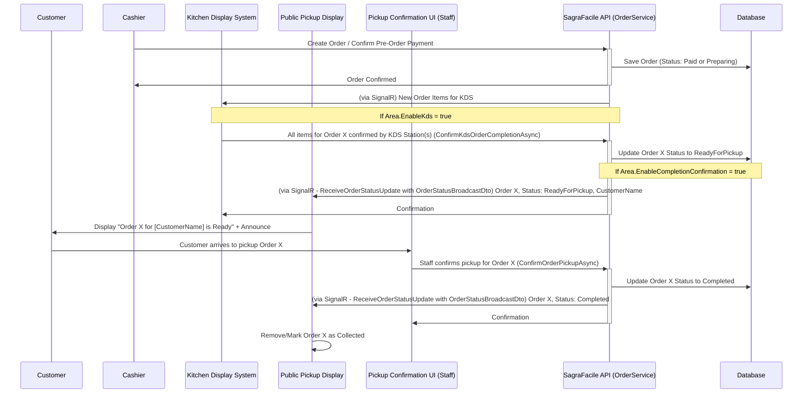

# SagraFacile - Public Order Pickup Display Architecture

This document outlines the architecture for the public-facing Order Pickup Display screen. This screen will show customers which orders are ready to be collected, with real-time updates and audio announcements.

## 1. Core Concepts

*   **Purpose:** Provide a visual and audible notification system for customers when their order transitions to `OrderStatus.ReadyForPickup`.
*   **Trigger:** Orders appear on this display when their `OrderStatus` becomes `ReadyForPickup`.
*   **Removal:** Orders are removed (or marked as collected) from this display when their `OrderStatus` transitions to `Completed`. This is triggered by staff action.
*   **Real-time:** Utilizes SignalR for immediate updates to the display.
*   **Audio:** Leverages browser-based Text-to-Speech for announcements.

## 2. Workflow Integration

*   The display integrates with the existing configurable order workflow defined in `WorkflowArchitecture.md`.
*   **Key Prerequisite:** For an Area to effectively use this display, its `EnableCompletionConfirmation` flag (in `Area` settings) **must be set to `true`**.
    *   If `true`, orders will transition to `ReadyForPickup` and wait for a staff member to confirm pickup (moving them to `Completed`).
    *   If `false`, orders might bypass `ReadyForPickup` or transition through it too quickly to be useful on the display.

## 3. Backend Implementation (SagraFacile.NET)

### 3.1. `OrderService.cs`

*   **`SendOrderStatusUpdateAsync(string orderId, OrderStatus status, int organizationId, int areaId)` (Refactor Existing Method):**
    *   This private helper method within `OrderService` (called after status changes) **must be refactored**.
    *   Currently, it might send a generic message like `"OrderPreparing"`.
    *   It needs to be modified to send a specific message, e.g., `"ReceiveOrderStatusUpdate"`, to clients.
    *   The payload for this message should be a new DTO, `OrderStatusBroadcastDto`:
        ```csharp
        // SagraFacile.NET.API/DTOs/OrderStatusBroadcastDto.cs (NEW FILE)
        public class OrderStatusBroadcastDto
        {
            public string OrderId { get; set; }
            public OrderStatus NewStatus { get; set; }
            public int OrganizationId { get; set; }
            public int AreaId { get; set; }
            public string? CustomerName { get; set; } // For display and announcement
            public string? TableNumber { get; set; } // Optional, for context
            public DateTime StatusChangeTime { get; set; } = DateTime.UtcNow;
        }
        ```
    *   This DTO will be broadcast to the relevant SignalR group (e.g., `Area-{areaId}`).
*   **`GetOrdersByStatusAsync(int areaId, OrderStatus status)` (New Method):**
    *   A new public method in `IOrderService` and `OrderService`.
    *   Purpose: To allow the public display to fetch the initial list of orders that are currently `ReadyForPickup`.
    *   Logic:
        *   Accepts `areaId` and `status` (will be `OrderStatus.ReadyForPickup`).
        *   Validates `areaId`.
        *   Filters orders by `areaId`, `status`, and the **current open `DayId`**.
        *   Orders by `OrderDateTime` (oldest first).
        *   Maps results to `OrderDto`.
*   **`ConfirmOrderPickupAsync(string orderId, ClaimsPrincipal user)` (Existing Method):**
    *   This existing service method is used by staff to mark an order as collected.
    *   It transitions the `OrderStatus` to `Completed`.
    *   It will trigger `SendOrderStatusUpdateAsync`, which will notify the public display to remove the order.

### 3.2. `PublicController.cs`

*   **`GET /api/public/areas/{areaId}/orders/ready-for-pickup` (New Endpoint):**
    *   Route: `[HttpGet("areas/{areaId}/orders/ready-for-pickup")]`
    *   `[AllowAnonymous]`
    *   Calls `_orderService.GetOrdersByStatusAsync(areaId, OrderStatus.ReadyForPickup)`.
    *   Returns `IEnumerable<OrderDto>`.

### 3.3. `OrdersController.cs`

*   **`PUT /api/orders/{orderId}/confirm-pickup` (Ensure Exists/Correct):**
    *   This endpoint is called by the staff-facing UI to confirm an order has been picked up.
    *   It should call `_orderService.ConfirmOrderPickupAsync(orderId, User)`.
    *   Requires authorization (e.g., Cashier, Admin, SuperAdmin).

### 3.4. `OrderHub.cs`

*   **Group Management:** The existing `JoinAreaQueueGroup(string areaId)` and `LeaveAreaQueueGroup(string areaId)` methods will be used by the public display client to subscribe to updates for a specific area.
*   **Client-side Handler:** The frontend will listen for a message named (e.g.) `"ReceiveOrderStatusUpdate"` which carries the `OrderStatusBroadcastDto`.

## 4. Frontend Implementation (sagrafacile-webapp)

### 4.1. Public Pickup Display Page

*   **Route:** `/pickup-display/org/{orgSlug}/area/{areaId}/page.tsx` (New Page)
*   **Functionality:**
    *   On load, fetches initial orders via `GET /api/public/areas/{areaId}/orders/ready-for-pickup`.
    *   Connects to `OrderHub` via `useSignalRHub` and calls `JoinAreaQueueGroup(areaId)`.
    *   Listens for `"ReceiveOrderStatusUpdate"` SignalR messages:
        *   If `NewStatus == OrderStatus.ReadyForPickup`: Add/highlight order in the list. Trigger TTS announcement.
        *   If `NewStatus == OrderStatus.Completed`: Remove order from the list.
        *   Other statuses: Potentially update display if an order moves out of `ReadyForPickup` for other reasons (e.g., cancellation, though less common at this stage).
    *   **UI:**
        *   Clear, large display of Order ID (or a portion of it) and Customer Name.
        *   Visually distinguish newly added/announced orders.
        *   Handle "No orders ready" state.
    *   **Text-to-Speech (TTS):**
        *   Use `window.speechSynthesis` to announce orders (e.g., "Order [ID] for [Customer Name] is ready!").
        *   Consider making the announcement part a reusable component, similar to the `qdisplay` page.

### 4.2. Staff Pickup Confirmation Page

*   **Route:** `/app/org/{orgId}/area/{areaId}/pickup-confirmation/page.tsx` (New Page, Role-Protected)
*   **Functionality:**
    *   Fetches orders with `OrderStatus.ReadyForPickup` for the current `areaId` (e.g., using `orderService.getOrders({ areaId, statuses: [OrderStatus.ReadyForPickup], dayId: currentDayId })`).
    *   Displays a list of these orders.
    *   Each order has a "Confirm Pickup" button.
    *   Button click calls a new frontend service function `orderService.confirmOrderPickup(orderId)`, which in turn calls the `PUT /api/orders/{orderId}/confirm-pickup` backend endpoint.
    *   UI should update optimistically or re-fetch upon successful confirmation.

### 4.3. Types & Services

*   **`src/types/index.ts`:**
    *   Add `OrderStatusBroadcastDto`.
    *   Ensure `OrderDto` includes `customerName`.
*   **`src/services/orderService.ts` (or `apiClient.ts`):**
    *   Add function to fetch public ready orders: `getPublicReadyForPickupOrders(areaId: number): Promise<OrderDto[]>`
    *   Add function to confirm pickup: `confirmOrderPickup(orderId: string): Promise<OrderDto>`

## 5. Sequence Diagram



## 6. Future Considerations
*   Repeating announcements for orders not picked up after a certain time.
*   Visual customization options for the display.
*   Displaying more order details (e.g., a summary of items) if screen real estate allows.
