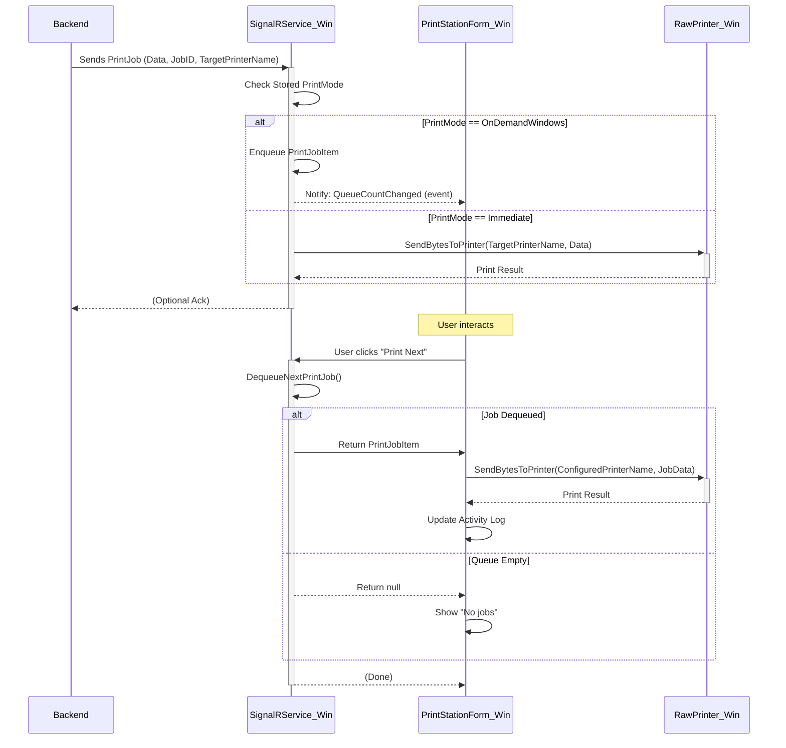

# SagraFacile Printing Architecture

# SagraFacile - Enhanced Printing Architecture (Revision 3)

This document details the revised architecture for printing receipts and comandas (kitchen/bar orders) within SagraFacile. It accommodates flexible workflows (defined in `WorkflowArchitecture.md`), multiple printer types (Network and USB via a companion app), and multiple cashier stations within the same area.

## 1. Core Concepts

*   **Hybrid Approach:** Supports both network-connected printers (typically ESC/POS compatible, accessed via TCP/IP) and USB-connected printers managed by a dedicated Windows application (`SagraFacile.WindowsPrinterService`).
*   **Centralized Control:** The Backend API orchestrates all printing tasks via a `PrintService`. The frontend cashier interface *does not* print directly (except potentially via `window.print()` as a fallback if no printer configured).
*   **Configuration Driven:** Administrators define printers, assign them to cashier stations or specific menu categories, and configure printing behavior.
*   **Workflow Integration:** Printing events are triggered by the Backend `OrderService` at specific points in the order lifecycle, determined by the configuration set in `WorkflowArchitecture.md`.
*   **Cashier Stations:** Multiple, distinct points of sale within a single `Area`, each potentially with its own dedicated receipt printer. This allows for greater operational flexibility.

## 2. Database Schema Changes

*   **`Printer` Entity:** Stores details about each physical or logical printer.
    *   `Id` (int, PK)
    *   `OrganizationId` (int, FK)
    *   `Name` (string): User-friendly identifier (e.g., "Cassa 1 Receipt", "Bar Comande").
    *   `Type` (enum: `Network`, `WindowsUsb`): How the printer is accessed.
    *   `ConnectionString` (string):
        *   For `Network`: "IP_Address:Port" (e.g., "192.168.1.100:9100").
        *   For `WindowsUsb`: A unique GUID identifying the specific `SagraFacile.WindowsPrinterService` instance managing this printer.
    *   `WindowsPrinterName` (string, nullable): **Required if `Type` is `WindowsUsb`**. The exact name of the printer recognized by the Windows OS hosting the companion service (e.g., "EPSON TM-T20II Receipt").
    *   `IsEnabled` (bool): Whether the printer is active.
    
*   **`CashierStation` Entity:** Represents a distinct point of sale within an Area.
    *   `Id` (int, PK)
    *   `OrganizationId` (int, FK)
    *   `AreaId` (int, FK - which Area this station is in)
    *   `Name` (string, e.g., "Cassa Ingresso 1", "Cassa Bar Mobile", "Postazione Tablet 3"): How staff will identify it.
    *   `ReceiptPrinterId` (int, FK to `Printer`): The specific printer assigned to this station for receipts.
    *   `PrintComandasAtThisStation` (bool, default: `false`): If `true`, comandas for orders taken at this station will print to its receipt printer.
    *   `IsEnabled` (bool, default: `true`): Whether the station is currently active.

*   **`PrinterCategoryAssignment` Entity:** Maps Menu Categories to Printers for comanda printing.
    *   `PrinterId` (int, FK to Printer)
    *   `MenuCategoryId` (int, FK to MenuCategory)
    *   *(Composite Primary Key: `PrinterId`, `MenuCategoryId`)*
    
*   **`Area` Entity Updates:**
    *   `ReceiptPrinterId` (int, nullable FK to Printer): Specifies the default printer for receipts in this Area when a specific CashierStation is not selected.
    *   `PrintComandasAtCashier` (bool, default: `false`):
        *   If `true`: Comandas for orders from this Area (not tied to a specific CashierStation) are printed at the `ReceiptPrinterId` location.
        *   If `false`: Comandas are printed at the station printers defined by `PrinterCategoryAssignment`.

*   **`Order` Entity Updates:**
    *   `CashierStationId` (int, nullable FK to CashierStation): Records which station an order originated from, useful for auditing and ensuring reprints go to the correct station's printer.

## 3. Components and Data Flow

### 3.1. Admin UI (Frontend)

*   **Printer Management (`/admin/printers`):**
    *   CRUD interface for `Printer` entities.
    *   Form includes fields for Name, Type (dropdown), ConnectionString (input, potentially validated based on Type), WindowsPrinterName (input, conditionally required), IsEnabled (toggle).
    *   For `WindowsUsb` type, the UI should ideally generate a GUID for the `ConnectionString` to ensure uniqueness and display it clearly.
    
*   **Cashier Station Management (`/admin/cashier-stations`):**
    *   List of all Cashier Stations for the organization, filterable by Area.
    *   Form to add/edit stations:
        *   Select Area
        *   Set Name
        *   Choose ReceiptPrinterId from available printers
        *   Set PrintComandasAtThisStation flag
        *   Enable/Disable the station
    
*   **Category Assignment (`/admin/printer-assignments` or similar):**
    *   Interface to manage `PrinterCategoryAssignment` records.
    *   Likely a view per printer or per category showing current assignments with options to add/remove mappings (e.g., multi-select lists).
    
*   **Area Configuration (`/admin/areas/{areaId}`):**
    *   Dropdown to select the default `ReceiptPrinterId` from available `Printer` entities within the organization.
    *   Toggle switch for default `PrintComandasAtCashier`.
    *   Possibly a list of Cashier Stations configured for this Area (read-only), with a link to the main Cashier Stations admin page.

### 3.2. Cashier Interface (Frontend)

*   **Station Selection:**
    *   When a cashier navigates to an Area (e.g., `/app/org/[orgId]/cashier/area/[areaId]`), they'll see a selection UI if the Area has multiple enabled Cashier Stations.
    *   This selection UI displays the `Name`s of available stations for that Area (dropdown or grid).
    *   The last selection is remembered via browser `localStorage` for convenience.
    *   If an Area has no Cashier Stations defined, or only one, this step might be skipped.
    
*   **Active Station Display:**
    *   The cashier interface prominently displays the active Cashier Station name.
    *   Optional: Display the assigned printer name for confidence.
    
*   **Session State:**
    *   Once selected, the Cashier Station details (`Id`, `Name`, `ReceiptPrinterId`, etc.) are stored in the frontend session state.
    *   When creating an order, the `CashierStationId` is included in the API payload.

### 3.3. Backend API (`SagraFacile.NET`)

*   **New Controller: `CashierStationsController`**
    *   CRUD endpoints for managing Cashier Stations.
    *   Authentication/Authorization requirements similar to other admin endpoints.

*   **`OrderService` Updates:**
    *   Update `CreateOrderAsync` to accept and record `CashierStationId`.
    *   When preparing orders for printing, determine the appropriate printer based on:
        1. The order's `CashierStationId` (if available)
        2. The Area's default `ReceiptPrinterId` (as fallback)

*   **`PrintService` (`IPrintService`, `PrintService`):**
    *   **Responsibilities:**
        *   Generate formatted print data (Receipts, Comandas) including text and QR codes.
            *   **NEW: ESC/POS Templating Strategy:** Employ a dedicated helper class/service (e.g., `EscPosDocumentBuilder`) to construct ESC/POS command sequences. This service will encapsulate common operations (e.g., text formatting, image/logo printing, QR code generation, paper cutting), improving code maintainability, reusability, and testability.
            *   **NEW: QR Code Content:**
                *   For Receipts: QR codes may contain the Order ID for quick reprinting/lookup and a URL for customer feedback/socials?.
                *   For Comandas: Typically not required, but if implemented, could contain Order ID or specific item identifiers.
        *   Determine target printer(s) based on:
            *   For receipts: The `CashierStation`'s `ReceiptPrinterId` or Area's default if no station.
            *   For comandas: Based on the printing flags (`PrintComandasAtThisStation` for the station, or `PrintComandasAtCashier` for the Area) and `PrinterCategoryAssignment` mappings.
            *   **NEW: Explicit Comanda Printer Determination Logic:**
                1.  If `Order.CashierStationId` is set AND the associated `CashierStation.PrintComandasAtThisStation` is `true`: All comandas for this order will print to the `CashierStation.ReceiptPrinterId`. This overrides category-specific assignments for this order. This print occurs *immediately* when the order is created or confirmed (e.g., by a cashier).
                2.  Else if (`Order.CashierStationId` is NULL or `CashierStation.PrintComandasAtThisStation` is `false`):
                    *   If `Area.PrintComandasAtCashier` (for the order's Area) is `true`: All comandas for this order will print to the `Area.ReceiptPrinterId`. This print also occurs *immediately* when the order is created or confirmed.
                    *   Else (the default behavior for dedicated comanda printers, typically triggered by a workflow step like waiter confirmation if not printed initially): Iterate through `OrderItems`. For each item, determine its `MenuCategory` and find the `Printer(s)` assigned via `PrinterCategoryAssignment`. Group items by their target comanda printer and generate a separate, consolidated comanda document for each unique printer. This type of comanda printing is typically triggered by a workflow progression (e.g., after waiter confirmation) *only if a comanda was not already printed* due to the station/area flags mentioned above.
        *   Dispatch print jobs to the correct printer type (Network TCP or SignalR message).
    *   **Key Methods:**
        *   `Task PrintOrderDocumentsAsync(Order order, PrintJobType jobType)`: Called by `OrderService`. 
            *   Determines what needs printing based on `jobType`, the order's `CashierStationId` (if present), configuration, and workflow state.
            *   Specifically for `PrintJobType.Comanda`, `OrderService` implements logic to:
                *   Print immediately on order creation/payment if `CashierStation.PrintComandasAtThisStation` or `Area.PrintComandasAtCashier` is true.
                *   Print on waiter confirmation (`ConfirmOrderPreparationAsync`) *only if a comanda was not printed initially* and the workflow step requires it (e.g., order moves to `Preparing` for KDS, or directly to completion if KDS is skipped).
            *   Fetches relevant printers and calls `SendToPrinterAsync`.
        *   `Task SendToPrinterAsync(Printer printer, string formattedEscPosData)`: Handles the actual sending.
            *   If `printer.Type == PrinterType.Network`: Parse `ConnectionString`, open TCP socket, send data, close socket. Handle errors (log, potentially retry based on error type).
            *   If `printer.Type == PrinterType.WindowsUsb`: Look up the SignalR `ConnectionId` for the `printer.ConnectionString` (GUID) from the `OrderHub`'s registry. Send a targeted SignalR message `("PrintJob", printer.WindowsPrinterName, formattedEscPosData)` to that connection. Handle errors (e.g., companion app offline, SignalR send failure - log, notify admin if critical).

*   **`OrderHub` (SignalR):**
    *   **Companion App Registration:**
        *   `Dictionary<string, string> _printerConnections`: Thread-safe dictionary mapping `Printer.ConnectionString` (GUID) to SignalR `ConnectionId`.
        *   `OnConnectedAsync` / `OnDisconnectedAsync`: Manage adding/removing basic connections.
        *   `Task RegisterPrinterClient(string printerGuid)`: Called by companion app upon connection.
            *   The `printerGuid` (from the companion app's configuration, matching a `Printer.ConnectionString` in the backend) is used to identify and register the client.
            *   Updates the dictionary with the mapping. Logs success/failure.
    *   **Print Job Message:** The `PrintService` uses `Clients.Client(connectionId).SendAsync("PrintJob", ...)` to send jobs to specific companion apps. The message typically includes a `jobId`, `targetWindowsPrinterName`, and `formattedEscPosData`.
    *   **NEW: Optional Print Job Status Feedback:** Consider adding a Hub method for the companion app to report back the status of a print job (e.g., `ReportPrintJobStatus(string jobId, bool success, string errorMessage)`). This allows the backend to log detailed outcomes and potentially alert administrators.

### 3.4. Windows Companion App (`SagraFacile.WindowsPrinterService`)

*   **Architecture:** .NET Windows Forms/Worker Service application running in the system tray.
*   **Configuration:** Needs a mechanism (e.g., `settings.json` managed by `SettingsForm.cs`) to store:
    *   Backend SignalR Hub **Host and Port** (e.g., `your-sagrafacile-domain.com:7055` or `192.168.1.100:5001`). The service will construct the full URL (e.g., `https://{Host_Port}/api/orderhub`).
    *   The unique `Printer.ConnectionString` (GUID) assigned to *this instance* in the SagraFacile Admin UI. This GUID identifies which `WindowsUsb` printer entry this service represents and is crucial for the `RegisterPrinterClient` call.
    *   Selected local Windows printer name (primarily for user reference and potential local test print feature; print jobs from the hub specify the target printer name directly).
*   **Functionality:**
    *   **SignalR Client:**
        *   Uses `.NET SignalR Client` library.
        *   Constructs the full Hub URL from the configured Host and Port.
        *   Connects to the backend `OrderHub` on startup.
        *   Handles reconnection attempts.
        *   Upon successful connection, calls `hubConnection.InvokeAsync("RegisterPrinterClient", configuredPrinterGuid);`.
    *   **Message Handler:**
        *   Listens for `hubConnection.On<string, string, string>("PrintJob", (jobId, targetWindowsPrinterName, printData) => { ... });`.
    *   **Printing Logic:**
        *   Takes the `targetWindowsPrinterName` and `printData` (expected to be ESC/POS or raw text).
        *   Uses appropriate Windows printing APIs to send the `printData` directly to the specified local `targetWindowsPrinterName`.
        *   **NEW: Error Handling & Feedback:** If printing fails (e.g., printer offline, invalid name, Windows error), log the error locally. If the feedback mechanism is implemented, send a status message back to the `OrderHub` via `ReportPrintJobStatus(jobId, false, "Error details...")`.
*   **Security:**
    *   Secure the SignalR Hub (e.g., HTTPS/WSS, authorize hub methods).
    *   The `Printer.ConnectionString` (GUID) acts as the primary identifier for the Windows Printer Service instance. Ensure GUIDs are unique and managed securely.
    *   All communication with the backend (including SignalR) should be over HTTPS/WSS.
*   **Station Selection:** The UI for station selection should be intuitive, especially in busy environments. Consider visual cues (icons, colors) to help quickly identify stations.

## 4. Printing Scenarios (High Level Flow)

*   **Receipt From Cashier Station (Network Printer):**
    1. Cashier selects a Cashier Station at login (or uses the only one available).
    2. `OrderService` -> `PrintService` -> Get Order's `CashierStationId` -> Get station's `ReceiptPrinterId` -> Fetch `Printer` (Type=Network) -> Generate Receipt ESC/POS -> `PrintService` opens TCP to `Printer.ConnectionString` -> Send Data.

*   **Receipt From Cashier Station (USB Printer):**
    1. Cashier selects a Cashier Station at login (or uses the only one available).
    2. `OrderService` -> `PrintService` -> Get Order's `CashierStationId` -> Get station's `ReceiptPrinterId` -> Fetch `Printer` (Type=WindowsUsb) -> Generate Receipt ESC/POS -> `PrintService` looks up ConnectionId for `Printer.ConnectionString` (GUID) in `OrderHub` -> `PrintService` sends SignalR "PrintJob" to specific Companion App -> Companion App receives message -> Companion App sends data to `Printer.WindowsPrinterName` via local Windows API.

*   **Comandas (Cashier Station with `PrintComandasAtThisStation=true`):**
    1. Same flow as Receipt printing, but with comanda data sent to the station's receipt printer. This occurs *immediately* upon order creation or payment confirmation at the cashier.

*   **Comandas (Stations with `PrintComandasAtThisStation=false` or no station/Area default, where `Area.PrintComandasAtCashier` is also `false`):**
    1. `OrderService` -> `PrintService`. This path is typically triggered by a workflow step like waiter confirmation (`ConfirmOrderPreparationAsync`).
    2. `PrintService` -> Get OrderItems -> Group by Category -> Find assigned `Printer`s via `PrinterCategoryAssignment`.
    3. For each Printer: Generate Station Comanda ESC/POS -> Send via TCP (Network) or SignalR (WindowsUsb) based on printer type.
    4. **Important**: This path is followed *only if a comanda was not already printed* at the initial order creation/payment stage due to overriding station/area flags.

*   **Reprinting Documents (Receipts & Optional Comandas):**
    1. User triggers reprint via Frontend UI (e.g., ReprintOrderDialog on Cashier page, or Actions menu on Admin Orders page).
    2. Frontend calls Backend API (`POST /api/orders/{orderId}/reprint`) specifying `ReprintJobType` (`ReceiptOnly` or `ReceiptAndComandas`).
        *   **NEW (Admin Reprint):** If initiated from Admin UI, the frontend can optionally include a `PrinterId` in the request body if the admin selected a specific printer.
    3. `OrdersController` calls `PrinterService.ReprintOrderDocumentsAsync`.
    4. `PrinterService` fetches the Order.
        *   **NEW (Printer Selection for Admin Reprint):** If `ReprintRequestDto.PrinterId` is provided, `PrinterService` attempts to use this printer (validating it belongs to the order's organization and is enabled). This overrides the default printer determination for this specific reprint instance.
        *   If no `PrinterId` is specified in the request (typical for Cashier reprint) or the specified printer is invalid, `PrinterService` determines the **target printer** using the default logic: Order's `CashierStation.ReceiptPrinter` or fallback to `Area.ReceiptPrinter`.
    5. `PrinterService` generates Receipt ESC/POS data.
    6. If `ReceiptAndComandas` requested, `PrinterService` generates a *single, consolidated* Comanda ESC/POS document for *all* order items.
    7. `PrinterService` sends the Receipt job and (if applicable) the single Comanda job to the **determined target printer** via `SendToPrinterAsync`.

## 5. Key Considerations

*   **ESC/POS Generation:** Requires a robust method in `PrintService` to create printer-compatible commands, including text formatting, **item notes**, cutting, and QR code printing. **MODIFIED:** As noted above, leveraging a dedicated `EscPosDocumentBuilder` service is recommended for maintainability and abstraction.
*   **Error Handling:**
    *   **MODIFIED:** Implement retry logic for network printers (e.g., for transient network issues).
    *   Log all print failures comprehensively (both in the Backend API and optionally in the Companion App).
    *   Consider a mechanism for notifying administrators or cashiers of persistent or critical print failures (e.g., via SignalR message to an admin UI, or an error indicator on the cashier screen).
    *   **NEW: Companion App Feedback:** The `WindowsPrinterService` should log its own errors. If a feedback loop to the `OrderHub` is implemented, it can report print success/failure, aiding centralized diagnostics.
*   **Companion App Reliability:** Ensure the companion app runs reliably, reconnects automatically, and has clear diagnostics.
*   **Security:**
    *   **MODIFIED:** Secure the SignalR Hub. Ensure only authenticated companion apps can register using a token/secret mechanism for the `RegisterPrinterClient` method.
    *   All communication with the backend (including SignalR) should be over HTTPS/WSS.
*   **Station Selection:** The UI for station selection should be intuitive, especially in busy environments. Consider visual cues (icons, colors) to help quickly identify stations.
*   **Fallbacks:**
    *   **MODIFIED: Fallback Strategy Details:** Define a clear fallback strategy if a primary configured printer (e.g., `CashierStation.ReceiptPrinterId`) is detected as offline (e.g., TCP connection timeout, SignalR client not registered/responsive). Options to consider:
        1.  **Automatic Redirection:** Attempt to print to a designated secondary/Area default printer (`Area.ReceiptPrinterId`).
        2.  **User Notification & Choice:** Alert the cashier and provide options:
            *   Select an alternative available printer.
            *   Queue the print job for later retry.
            *   Fallback to browser `window.print()` (for receipts, if feasible).
        3.  **Log and Alert:** Log the failure prominently and alert an administrator, requiring manual intervention.
        *   The chosen strategy should be configurable or at least well-defined.

## 6. On-Demand Printing for Windows Companion App (Future Enhancement)

This section outlines a planned enhancement for the `SagraFacile.WindowsPrinterService` to support on-demand printing of comandas, where jobs are queued locally and printed manually by staff at the print station.

### 6.1. Concept

*   **Local Queuing:** For printers configured for on-demand mode, the Windows Printer Service will not print comandas immediately upon receipt from the backend. Instead, it will add them to an internal, in-memory queue.
*   **User-Triggered Printing:** Staff at the print station will use a new, simple UI (`PrintStationForm`) within the Windows Printer Service to manually trigger the printing of the next comanda(s) from the queue.
*   **FIFO Order:** Comandas will be printed in a First-In, First-Out (FIFO) order.
*   **Independence from KDS:** This printing mechanism will operate independently of KDS status updates.

### 6.2. Configuration

*   **Backend (`Printer` Entity):**
    *   A new `PrintMode` enum (`Immediate`, `OnDemandWindows`) will be added to the `Printer` entity.
    *   This will be configurable in the Admin UI for each `WindowsUsb` printer.
*   **Windows Printer Service (`SettingsForm.cs`):**
    *   An optional local setting for "Number of comandas to print per click" (e.g., 1, 2, 3; default 1) can be added in the future. For the initial version, it will print one comanda per click.

### 6.3. Workflow and Component Changes

*   **Backend API (`SagraFacile.NET`):**
    *   **`Printer` Entity:** Updated with `PrintMode` property and enum.
    *   **DTOs & Services:** `PrinterDto`, `PrinterUpsertDto`, and `PrinterService` updated to manage `PrintMode`.
    *   **New Endpoint:** `GET /api/printers/config/{instanceGuid}` to allow the Windows service to fetch its `PrintMode` and `WindowsPrinterName`.
*   **Windows Printer Service (`SagraFacile.WindowsPrinterService`):**
    *   **`SignalRService.cs`:**
        *   Fetches its `PrintMode` from the new backend endpoint upon registration.
        *   If `PrintMode` is `OnDemandWindows`, incoming print jobs are added to an internal `ConcurrentQueue<PrintJobItem>`. An event (`OnDemandQueueCountChanged`) is raised.
        *   If `PrintMode` is `Immediate`, jobs are printed directly as before.
        *   Exposes methods to dequeue jobs and get the current queue count.
    *   **`PrintStationForm.cs` (New UI Form):**
        *   Launched from the tray icon menu.
        *   Displays "Comande in Attesa: [X]".
        *   Features a large "STAMPA PROSSIMA COMANDA" button (triggers on Enter key as well).
        *   On button click, it requests `SignalRService` to dequeue and print the next job using `IRawPrinter`.
        *   Updates pending count and optionally logs activity.
    *   **`ApplicationLifetimeService.cs`:**
        *   Adds a menu item to open/manage the `PrintStationForm`.
        *   Passes necessary dependencies to `PrintStationForm`.

### 6.4. Visual Flow (Windows Service Interaction)

